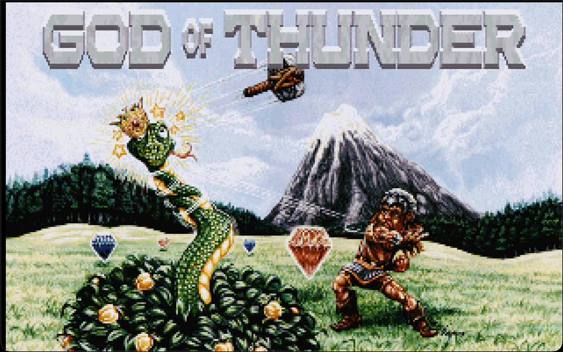
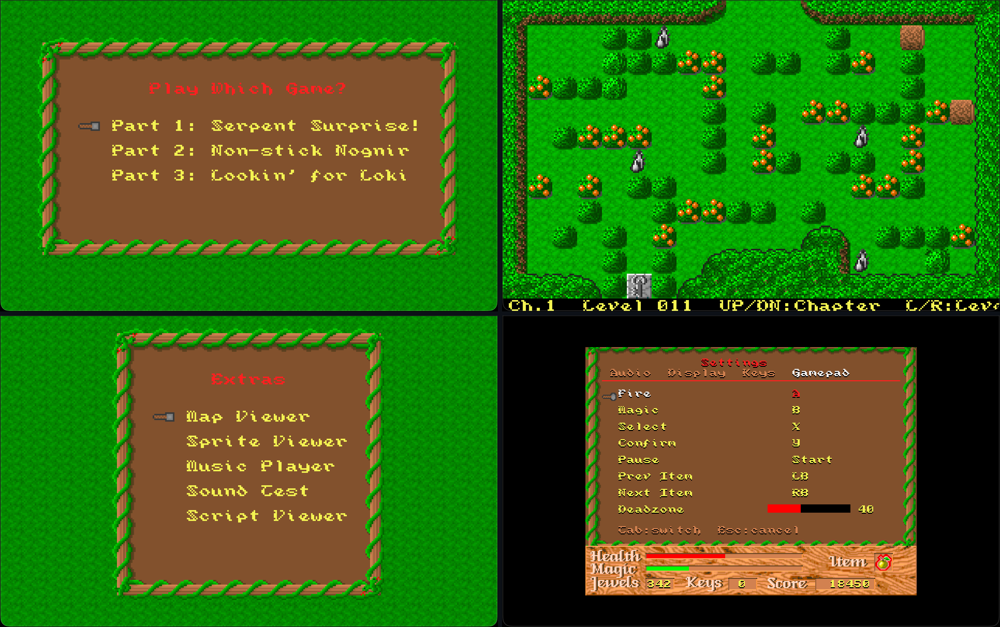
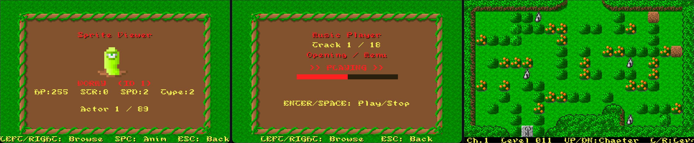

# God of Thunder — Native Port

<p align="center">
  
</p>

A native port of the 1994 DOS game **God of Thunder** by Ron Davis.
Runs as a normal desktop application via [raylib](https://www.raylib.com/) — no DOSBox required.

<p align="center">
  
</p>

## Features

- All 3 episodes playable natively (Linux, macOS, Windows)
- Reverse-engineered launcher matching the original GOT.EXE (opening sequence, title shake, credits)
- AdLib OPL2 music emulation via [ymfm](https://github.com/aaronsgiles/ymfm)
- Digital sound effects (VOC playback)
- Extras menu: Map Viewer, Sprite Viewer, Music Player, Sound Test, Script Viewer
- Configurable controls with gamepad support
- Web/WASM support via Emscripten
- Original DOS source preserved under `reference/` for study

<p align="center">
  
</p>

## Downloads

Grab the latest build from [Releases](https://github.com/darvell/GodOfThunder-Port/releases). Extract and play — game data is included.

## Building from Source

Requires CMake 3.20+ and a C/C++ compiler (clang, gcc, or MSVC). raylib is fetched
automatically via CMake's FetchContent.

```sh
cmake -B build -DCMAKE_BUILD_TYPE=Release
cmake --build build --target got
./build/got
```

## Web Build

Requires the [Emscripten SDK](https://emscripten.org/docs/getting_started/downloads.html).

```sh
./scripts/build_web.sh
./scripts/serve_web.sh dist_web
# Open http://localhost:8000/
```

Saves persist in browser storage. WebAudio may require a click on the canvas
before audio starts.

## DOS Build

The original per-episode source under `reference/src/` can still be compiled
with OpenWatcom. See `build.sh` and `scripts/toolchain/` for setup details.

## Project Structure

```
CMakeLists.txt          CMake build system
build.sh                DOS build script (OpenWatcom)
src/
  game/                 Unified game engine (all 3 episodes)
  native/               Native platform layer (raylib, audio, launcher)
  utility/              Shared resource/compression code
  digisnd/              Digital sound library
  owcompat/             OpenWatcom compatibility shims
reference/
  src/_g1/ _g2/ _g3/    Original per-episode DOS source
third_party/
  ymfm/                 OPL2/3 FM synthesis emulator (BSD)
scripts/
  build_web.sh          Emscripten build script
  toolchain/            OpenWatcom toolchain setup
web/
  emscripten_shell.html Custom HTML shell for WASM build
  emscripten_post.js    Emscripten runtime patches
docs/
  formats.md            File format documentation
```

## License

The original source code was released to the **public domain** by Ron Davis
on 2020-03-27. The native port code is also public domain. See [LICENSE](LICENSE)
for details.

Game graphics are copyright their original creators. Music and sound effects
are by Roy Davis — attribution appreciated.

Third-party code (ymfm) retains its own license (BSD 3-Clause).

## Credits

- **Ron Davis** — original God of Thunder game and source code
- **Roy Davis** — music and sound effects
- **ymfm** by Aaron Giles — OPL2 FM synthesis emulation
- **raylib** by Ramon Santamaria — graphics/audio/input framework
